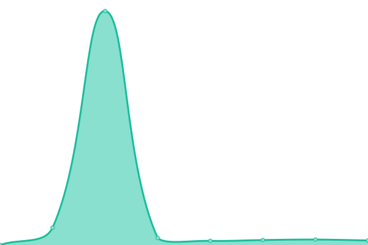

# [📈 Live Status](https://status.fazeproof.com): <!--live status--> **🟧 Partial outage**

This repository contains the open-source uptime monitor and status page for [So More](https://status.fazeproof.com), powered by [Upptime](https://github.com/upptime/upptime).

With [Upptime](https://upptime.js.org), you can get your own unlimited and free uptime monitor and status page, powered entirely by a GitHub repository. We use [Issues](https://github.com/so-more/proof-monitoring/issues) as incident reports, [Actions](https://github.com/so-more/proof-monitoring/actions) as uptime monitors, and [Pages](https://status.fazeproof.com) for the status page.

<!--start: status pages-->
<!-- This summary is generated by Upptime (https://github.com/upptime/upptime) -->
<!-- Do not edit this manually, your changes will be overwritten -->
<!-- prettier-ignore -->
| URL | Status | History | Response Time | Uptime |
| --- | ------ | ------- | ------------- | ------ |
|  [Interseed (interseed.app)](https://interseed.app) | 🟥 Down | [interseed-interseed-app.yml](https://github.com/so-more/proof-monitoring/commits/HEAD/history/interseed-interseed-app.yml) | 

 110ms
     
 | 

<a href="https://status.interseed.app/history/interseed-interseed-app">69.15%</a>
    

|  [Interseed Beta (try.interseed.app)](https://try.interseed.app) | 🟩 Up | [interseed-beta-try-interseed-app.yml](https://github.com/so-more/proof-monitoring/commits/HEAD/history/interseed-beta-try-interseed-app.yml) | 

 135ms
     
 | 

<a href="https://status.interseed.app/history/interseed-beta-try-interseed-app">100.00%</a>
    

|  [Interseed Alpha Mirror Nᵒ1 (flutterflow.interseed.app)](https://flutterflow.interseed.app) | 🟩 Up | [interseed-alpha-mirror-n-1-flutterflow-interseed-app.yml](https://github.com/so-more/proof-monitoring/commits/HEAD/history/interseed-alpha-mirror-n-1-flutterflow-interseed-app.yml) | 

 201ms
     
 | 

<a href="https://status.interseed.app/history/interseed-alpha-mirror-n-1-flutterflow-interseed-app">100.00%</a>
    

|  [Interseed Alpha Mirror Nᵒ2 (interseed.flutterflow.app)](https://interseed.flutterflow.app) | 🟩 Up | [interseed-alpha-mirror-n-2-interseed-flutterflow-app.yml](https://github.com/so-more/proof-monitoring/commits/HEAD/history/interseed-alpha-mirror-n-2-interseed-flutterflow-app.yml) | 

 233ms
     
 | 

<a href="https://status.interseed.app/history/interseed-alpha-mirror-n-2-interseed-flutterflow-app">100.00%</a>
    

|  [Website (interseed.co.uk)](https://interseed.co.uk) | 🟩 Up | [website-interseed-co-uk.yml](https://github.com/so-more/proof-monitoring/commits/HEAD/history/website-interseed-co-uk.yml) | 

 504ms
     
 | 

<a href="https://status.interseed.app/history/website-interseed-co-uk">100.00%</a>
    

|  [Website (www.interseed.co.uk)](https://www.interseed.co.uk) | 🟩 Up | [website-www-interseed-co-uk.yml](https://github.com/so-more/proof-monitoring/commits/HEAD/history/website-www-interseed-co-uk.yml) | 

 120ms
     
 | 

<a href="https://status.interseed.app/history/website-www-interseed-co-uk">100.00%</a>
    

<!--end: status pages-->

[**Visit our status website →**](https://status.fazeproof.com)

## 📄 License

- Powered by: [Upptime](https://github.com/upptime/upptime)
- Code: [MIT](./LICENSE) © [So More](https://status.fazeproof.com)
- Data in the `./history` directory: [Open Database License](https://opendatacommons.org/licenses/odbl/1-0/)
